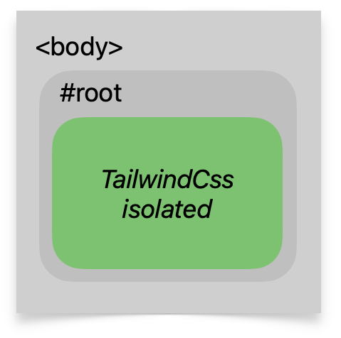
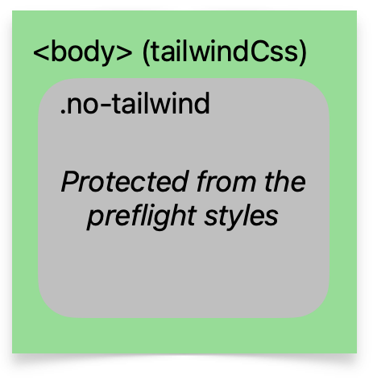

# Tailwind CSS + UI libraries = no conflicts 🚀


### What

[Tailwind CSS](https://tailwindcss.com/) plugin

### Why

To avoid style conflicts (CSS collisions/interference side effects) when using Tailwind CSS with other UI libraries like Antd, Vuetify etc.

### How

This plugin limits the scope of [Tailwind's opinionated preflight styles](https://tailwindcss.com/docs/preflight) to a customizable CSS selector.
So you can control exactly where in the DOM to apply these base styles — usually your own components, not third-party ones.

## Version 4 is here 🎉

[Migrate from v3](#migration-guide-v3--v4)

Looking for the v3 documentation? [v3 README](https://github.com/Roman86/tailwindcss-scoped-preflight/blob/v3/README.md)

Version 4 is built for **TailwindCSS v4** and uses the new CSS-first `@plugin` API — no JavaScript config needed.

Key changes from v3:

- Configure via `@plugin` in your CSS file, not `tailwind.config.js`
- No JS imports required
- Simpler option syntax using CSS property values

### ❤️ If you'd like to say thanks, buy me a coffee

[](https://www.buymeacoffee.com/romanjs)
<br/>Support/contact [tiny website](https://tailwindcss-scoped-preflight-plugin.vercel.app/)

[Discord server](https://discord.gg/CXHadKnaGk) for any discussions/questions/ideas/proposals — feel free to join.

## Strategies overview

Two isolation strategies are available, covering 99% of cases:

|                                    Strategy                                     | Description                                                                                                                                                                             |
| :-----------------------------------------------------------------------------: | --------------------------------------------------------------------------------------------------------------------------------------------------------------------------------------- |
|   `isolationStrategy: inside`<br/>   | Everything is protected from preflight styles, except the specified Tailwind root(s).<br/>Use it when all your Tailwind-powered content lives **inside some root container**.           |
| `isolationStrategy: outside`<br/> | Protects specific root(s) from preflight styles — Tailwind is everywhere outside.<br/>Use it when Tailwind is everywhere, but you want to **exclude some part of the DOM** from preflight. |

# Quick Start

### 1. Install

```bash
npm i -D tailwindcss-scoped-preflight
```

### 2. Replace your Tailwind import

Most projects start with a single import:

```css
@import "tailwindcss";
```

This includes Tailwind's **global preflight** (CSS reset) — which is exactly what this plugin replaces with a scoped version. To avoid having both global and scoped preflight in your CSS, replace the single import with granular ones that **skip preflight**:

```css
@import "tailwindcss/theme";
@import "tailwindcss/utilities";
```

> **Why not `@import "tailwindcss"`?** It bundles preflight that applies to `*`, `html`, `body` globally. With this plugin you want preflight scoped to your selector — having both defeats the purpose.

### 3. Add `@plugin` to your CSS file

#### 3.1 Lock Tailwind preflight inside a container

Use `isolationStrategy: inside` when all your Tailwind-powered content is under a single root element (like `.twp`). Preflight styles will only apply within that container.

```css
/* input.css */
@import "tailwindcss/theme";
@import "tailwindcss/utilities";

@plugin "tailwindcss-scoped-preflight" {
  isolationStrategy: inside;
  selector: .twp;
}
```

With an exclusion zone (to protect third-party markup nested under `.twp`):

```css
@plugin "tailwindcss-scoped-preflight" {
  isolationStrategy: inside;
  selector: .twp;
  except: .no-twp;
}
```

|          Option           | Value                          | Description                                                                                                  |
| :-----------------------: | ------------------------------ | ------------------------------------------------------------------------------------------------------------ |
|   `isolationStrategy`     | `inside`                       | Required. Activates the inside-container isolation mode.                                                     |
|      `selector`           | CSS selector (or comma-list)   | Required. The container(s) where Tailwind content lives. e.g. `.twp` or `.twp, [twp]`                       |
|   `except` (optional)     | CSS selector                   | Excludes nested elements from preflight. Useful for third-party markup under `.twp`.                         |
| `rootStyles` (optional)   | `move to container` (default)  | Moves root styles (html/body/:host) to the container selector.                                               |
|                           | `add :where`                   | Keeps root styles on root selectors but wraps them with `:where` so only matching items are affected.        |
|   `ignore` (optional)     | Comma-separated CSS selectors  | Keeps these preflight selectors untouched (skipped by the isolation strategy). e.g. `html, :host, *`         |
|   `remove` (optional)     | Comma-separated CSS selectors  | Removes preflight styles for these selectors entirely. e.g. `body, :before, :after`                          |

#### 3.2 Exclude a container from Tailwind preflight

Use `isolationStrategy: outside` when Tailwind is used everywhere, but you want one section of the page to be unaffected by preflight (e.g. a legacy widget or iframe content).

```css
/* input.css */
@import "tailwindcss/theme";
@import "tailwindcss/utilities";

@plugin "tailwindcss-scoped-preflight" {
  isolationStrategy: outside;
  selector: .no-twp;
}
```

With a `plus` selector (to re-enable preflight for Tailwind components nested inside the excluded zone):

```css
@plugin "tailwindcss-scoped-preflight" {
  isolationStrategy: outside;
  selector: .no-twp;
  plus: .twp;
}
```

|        Option         | Value                         | Description                                                                                                     |
| :-------------------: | ----------------------------- | --------------------------------------------------------------------------------------------------------------- |
| `isolationStrategy`   | `outside`                     | Required. Activates the outside-container isolation mode.                                                        |
|    `selector`         | CSS selector (or comma-list)  | Required. The container(s) to protect from preflight. e.g. `.no-twp`                                            |
|  `plus` (optional)    | CSS selector                  | Re-enables preflight for Tailwind components nested inside the excluded zone. e.g. `.twp`                       |
| `ignore` (optional)   | Comma-separated CSS selectors | Keeps these preflight selectors untouched (skipped by the isolation strategy).                                   |
| `remove` (optional)   | Comma-separated CSS selectors | Removes preflight styles for these selectors entirely.                                                           |

#### Choosing a good selector

Use a dedicated plain class name (`.twp`, `.no-twp`) or a data attribute (`[data-twp]`) as your container selector. Avoid selectors that contain colons (like Tailwind modifier syntax `.xl:some-class`) — they require CSS escaping (`\.xl\:some-class`) and add unnecessary complexity.

### 4. Use the selector in your DOM

```tsx
export function MyApp({ children }: PropsWithChildren) {
  return <div className={'twp'}>{children}</div>;
}
```

# Configuration examples

### Using multiple selectors

```css
@plugin "tailwindcss-scoped-preflight" {
  isolationStrategy: inside;
  selector: .twp, [twp];
}
```

> Although all strategies accept multiple selectors, it's recommended to use one short selector to avoid CSS bloat — selectors repeat many times in the generated CSS.

### Keeping some preflight styles unaffected

Use `ignore` to pass certain preflight selectors through without modification:

```css
@plugin "tailwindcss-scoped-preflight" {
  isolationStrategy: inside;
  selector: .twp;
  ignore: html, :host, *;
}
```

### Removing preflight styles by selector

Use `remove` to strip preflight styles for specific selectors entirely:

```css
@plugin "tailwindcss-scoped-preflight" {
  isolationStrategy: inside;
  selector: .twp;
  remove: body, :before, :after;
}
```

---

# Still using JS config?

TailwindCSS v4 still supports JavaScript configuration via `@config`, though it's [deprecated in favor of CSS-first configuration](https://tailwindcss.com/docs/functions-and-directives#config-directive). This plugin works with both approaches — **choose one, not both:**

| Approach | How | Recommended? |
|----------|-----|:------------:|
| **CSS-first** (`@plugin`) | Configure in your `.css` file | ✅ Yes |
| **JS config** (`@config`) | Configure in `tailwind.config.js` | For SCSS or gradual migration |

### Using `@config` with this plugin

```javascript
// tailwind.config.js
import scopedPreflightStyles from 'tailwindcss-scoped-preflight';

export default {
  plugins: [
    scopedPreflightStyles({
      isolationStrategy: 'inside',
      selector: '.twp',
    }),
  ],
};
```

```css
/* input.css */
@import "tailwindcss/theme";
@import "tailwindcss/utilities";
@config "./tailwind.config.js";
```

All options from the [inside](#31-lock-tailwind-preflight-inside-a-container) and [outside](#32-exclude-a-container-from-tailwind-preflight) strategy tables work the same way — pass them as object properties instead of CSS declarations.

> **Important:** Even with `@config`, use the **new v4 string-based options** — not the v3 function-based API. See the [migration guide](#migration-guide-v3--v4) for the full mapping.

---

# Using with SCSS/Sass

Sass preprocessors parse `.scss` files **before** TailwindCSS sees them. The `@plugin` block syntax contains values like `selector: .twp;` that Sass misinterprets — it sees `.twp` as the start of a decimal number and fails:

```
Error: Expected digit.
  ╷
  │   selector: .twp;
  │              ^
  ╵
```

#### Option A: Separate CSS file (recommended)

Move the `@plugin` directive and Tailwind imports to a plain `.css` file, then import it from your SCSS:

```css
/* tailwind.css */
@import "tailwindcss/theme";
@import "tailwindcss/utilities";

@plugin "tailwindcss-scoped-preflight" {
  isolationStrategy: inside;
  selector: .twp;
}
```

```scss
/* globals.scss */
@use "tailwind.css";

// your SCSS styles
```

#### Option B: Use `@config` with JS config

Use [`@config`](#still-using-js-config) to configure the plugin in JavaScript — Sass won't try to parse the plugin options:

```scss
/* globals.scss */
@import "tailwindcss/theme";
@import "tailwindcss/utilities";
@config "./tailwind.config.js";

// your SCSS styles
```

See the [`@config` section above](#using-config-with-this-plugin) for the `tailwind.config.js` example.

---

# Migration guide (v3 → v4)

TailwindCSS v4 replaced JavaScript config files with a CSS-first API. This plugin follows the same shift — configure via `@plugin` in CSS (recommended) or via [`@config`](#still-using-js-config) with updated options.

## Quick reference

| v3 (tailwind.config.js)                                           | v4 (input.css)                                         |
| ----------------------------------------------------------------- | ------------------------------------------------------ |
| `plugins: [scopedPreflightStyles({ ... })]`                       | `@plugin "tailwindcss-scoped-preflight" { ... }`       |
| `import { scopedPreflightStyles, isolateInsideOfContainer }`      | No JS import needed (or `import scopedPreflightStyles` with `@config`) |
| `isolationStrategy: isolateInsideOfContainer('.twp')`             | `isolationStrategy: inside; selector: .twp;`           |
| `isolationStrategy: isolateOutsideOfContainer('.no-twp')`         | `isolationStrategy: outside; selector: .no-twp;`       |
| `['.twp', '[twp]']` (array)                                       | `selector: .twp, [twp];` (comma-separated)             |
| `{ except: '.no-twp' }`                                           | `except: .no-twp;`                                     |
| `{ plus: '.twp' }`                                                | `plus: .twp;`                                          |
| `{ ignore: ['html', ':host'] }`                                   | `ignore: html, :host;`                                 |
| `{ remove: ['body'] }`                                            | `remove: body;`                                        |
| `modifyPreflightStyles: { ... }`                                  | Not available in v4                                    |
| Custom `isolationStrategy` function                               | Not available in v4                                    |
| `isolateForComponents`                                            | Not available in v4 — use `inside` strategy instead    |

## Before/after: inside strategy

**v3 (tailwind.config.js):**

```javascript
import { scopedPreflightStyles, isolateInsideOfContainer } from 'tailwindcss-scoped-preflight';

export default {
  plugins: [
    scopedPreflightStyles({
      isolationStrategy: isolateInsideOfContainer('.twp', {
        except: '.no-twp',
      }),
    }),
  ],
};
```

**v4 (input.css):**

```css
@import "tailwindcss/theme";
@import "tailwindcss/utilities";

@plugin "tailwindcss-scoped-preflight" {
  isolationStrategy: inside;
  selector: .twp;
  except: .no-twp;
}
```

## Before/after: outside strategy

**v3 (tailwind.config.js):**

```javascript
import { scopedPreflightStyles, isolateOutsideOfContainer } from 'tailwindcss-scoped-preflight';

export default {
  plugins: [
    scopedPreflightStyles({
      isolationStrategy: isolateOutsideOfContainer('.no-twp', {
        plus: '.twp',
      }),
    }),
  ],
};
```

**v4 (input.css):**

```css
@import "tailwindcss/theme";
@import "tailwindcss/utilities";

@plugin "tailwindcss-scoped-preflight" {
  isolationStrategy: outside;
  selector: .no-twp;
  plus: .twp;
}
```

## Before/after: multiple selectors

**v3 (tailwind.config.js):**

```javascript
scopedPreflightStyles({
  isolationStrategy: isolateInsideOfContainer(['.twp', '[twp]']),
})
```

**v4 (input.css):**

```css
@plugin "tailwindcss-scoped-preflight" {
  isolationStrategy: inside;
  selector: .twp, [twp];
}
```

## Dropped features

The following v3 features are not available in v4. TailwindCSS 4 moved away from JavaScript config entirely, so any feature that required a JS callback or JS-level hook cannot be supported.

| Feature | v3 Usage | Why removed |
| ------- | -------- | ----------- |
| `modifyPreflightStyles` | Object or function callback to alter individual CSS declarations | TW4 has no hook mechanism for JS-based style modification — all config is CSS strings |
| Custom `isolationStrategy` function | `isolationStrategy: ({ ruleSelector }) => string` | `@plugin` CSS blocks only accept string scalar values, not functions |
| `isolateForComponents` | Named export, was already deprecated in v3 | Deprecated in v3; removed in v4. Use `isolationStrategy: inside` with `rootStyles: add :where` for the same effect |
| Named strategy imports | `import { isolateInsideOfContainer } from 'tailwindcss-scoped-preflight'` | No JS config to import into — use `@plugin` directive or default import with `@config` |
